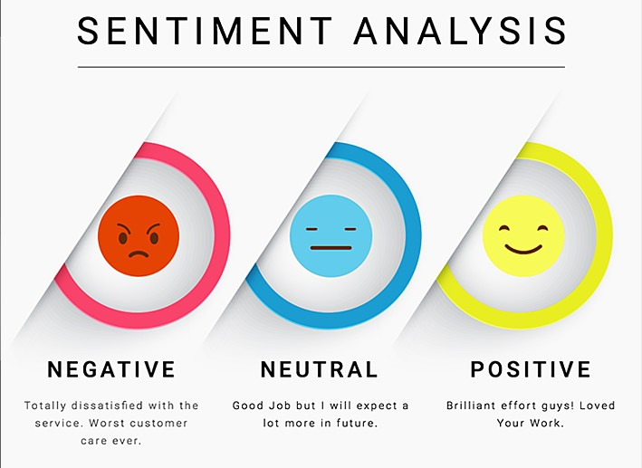

 <h1 align="center"> Twitter Sentiment Analysis <h1/>

## Table of contents
- [Project Description](#Description)
- [Required Packages](#Packages)
- [How To Run](#Run)

## Project Description
Sentiment analysis are essential to detect and understand customer feelings. Sentiment analysis can improve customer loyalty and retention through better service outcomes and customer experience.

Sentiment analysis is an application of natural language processing (NLP) that reveals the emotional states in human speech or text -- in Our case, the speech and text that customers generate. Businesses can use machine-learning-based sentiment analysis software to examine this speech and text for positive or negative sentiment about the brand.

## Required Packages:

- Python
- numpy
- nltk
- pickle
- Sklearn
- Re

## How To Run:
-> Use 

>Python Sentiment Analysis.py 

To run the project.
